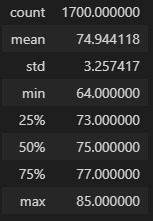
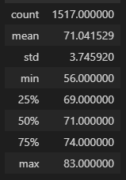

# Surfs Up Challenge

## Overview
An analysis of temperature observations for a particular weather station in the months of June and December was performed at request of client, using Hawaiian weather station data provided. Analysis goal is to investigate temperature variance at the extreme portions of the year to determine sustainability of year-round business operations for tourist ventures (surf and ice cream shops).

## Results

### June
June temperatures, displayed in summary below, average at 75 degrees F, mostly staying between 73 and 77. The lowest recorded June temperature is 64 degrees, and the highest is 85.

### December
December temperatures, displayed in summary below, average at 71 degrees F, mostly staying between 69 and 74. The lowest recorded December temperature is 56 degrees and the highest is 83.

### Comparison
In general, June and December temperatures in the target Hawaiian region seem to vary by only a few degrees. While the client can expect a higher number of days in December with temperatures not conducive to ice-cream related activities, at least half of the days in December can be expected to fall into the same range as the colder days of June.

## Summary
Analysis of temperature variance using the current data covered temperatures recorded between 2010 and 2017. While the weather data within this period is helpful, a further analysis using weather trends across several decades may provide more long-term outlooks, according to client interest.

While temperature comparisons are helpful in determining the sustainability of outdoor tourist-centered businesses, there are several other factors that may contribute to interest levels in these activities, including precipitation and UV index levels. Particularly, not many people want to eat ice cream in the rain, and if UV index levels rise above those comfortable for tourists, they may not want to participate in surfing activities. Other, tangentially weather-related factors may also interrupt business, including flooding, seasonal lodging availability, and tidal fluctuations at the beach.
